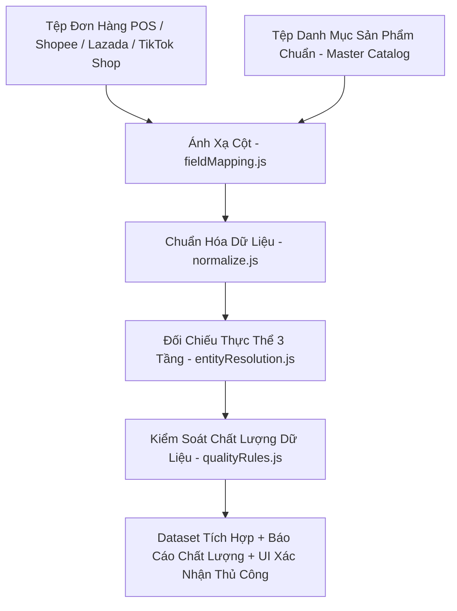

# 🛒 Hệ Thống Tích Hợp & Kiểm Soát Chất Lượng Dữ Liệu Bán Hàng Đa Nguồn

Dự án Khóa luận tốt nghiệp ngành Hệ thống thông tin — Trường Đại học Công nghệ Thông tin (UIT — ĐHQG TP.HCM).  
**Sinh viên thực hiện:** Phạm Anh Quốc (DA) & Trần Thanh Huy (BA).

---

## 🏛️ Kiến trúc & Luồng xử lý (Data Pipeline)

Hệ thống hoạt động theo kiến trúc Client-side pure JavaScript trên nền Vite + React. Toàn bộ quá trình chuẩn hóa, đối chiếu thực thể 3 tầng và kiểm soát chất lượng dữ liệu được thực thi trực tiếp tại trình duyệt.



---

## 📁 Cấu trúc thư mục dự án

```text
data-integration-app/
├── public/                 # Assets tĩnh
├── sample-data/            # Bộ dữ liệu mẫu Excel (POS, Shopee, Lazada, TikTok Shop, Catalog)
├── scripts/
│   └── generate-sample-data.cjs  # Script sinh dữ liệu giả lập kiểm thử
├── src/
│   ├── assets/
│   ├── logic/              # Modules xử lý lõi (Core Data Pipeline)
│   │   ├── __tests__/
│   │   │   └── logic.test.js    # Suite 47 unit tests tự động (Vitest)
│   │   ├── entityResolution.js  # Đối chiếu thực thể 3 tầng (ID exact -> Crosswalk -> Token-sort fuzzy)
│   │   ├── fieldMapping.js      # Ánh xạ tên cột tự động về schema chuẩn
│   │   ├── normalize.js         # Chuẩn hóa văn bản, mã đơn, kênh bán, trạng thái, ngày, số
│   │   ├── pipeline.js          # Main pipeline kết nối các modules
│   │   └── qualityRules.js      # Kiểm soát chất lượng dữ liệu (6 nhóm lỗi & 3 mức severity)
│   ├── App.jsx             # Giao diện chính React UI & 3 tính năng mở rộng
│   ├── index.css
│   └── main.jsx
├── index.html
├── package.json
├── README.md
└── vite.config.js
```

---

## 🛠️ Hướng dẫn cài đặt & Chạy ứng dụng

```bash
# 1. Cài đặt các gói phụ thuộc
npm install

# 2. Sinh tệp dữ liệu mẫu để chạy thử
node scripts/generate-sample-data.cjs

# 3. Chạy giao diện thử nghiệm (Dev server)
npm run dev

# 4. Chạy suite unit tests (Vitest)
npx vitest run

# 5. Đóng gói bản sản xuất (Production Build)
npm run build
```

---

## 📌 Các điểm cải tiến chính
- **Tách module hóa 100%**: Đã phân tách code monolithic ban đầu thành 5 module riêng biệt trong `src/logic/`.
- **Phân loại 3 mức xử lý lỗi**: `AUTO_FIXED` (tự động sửa), `NEEDS_CONFIRMATION` (cần người dùng xác nhận), `FLAGGED_ONLY` (gắn cờ cảnh báo).
- **Kiểm thử tự động**: Đảm bảo chất lượng bằng 47 unit test cases độc lập.
- **Tính năng mở rộng**: Xác nhận thủ công ER, Báo cáo chất lượng dữ liệu và Cấu hình xử lý trực quan.
