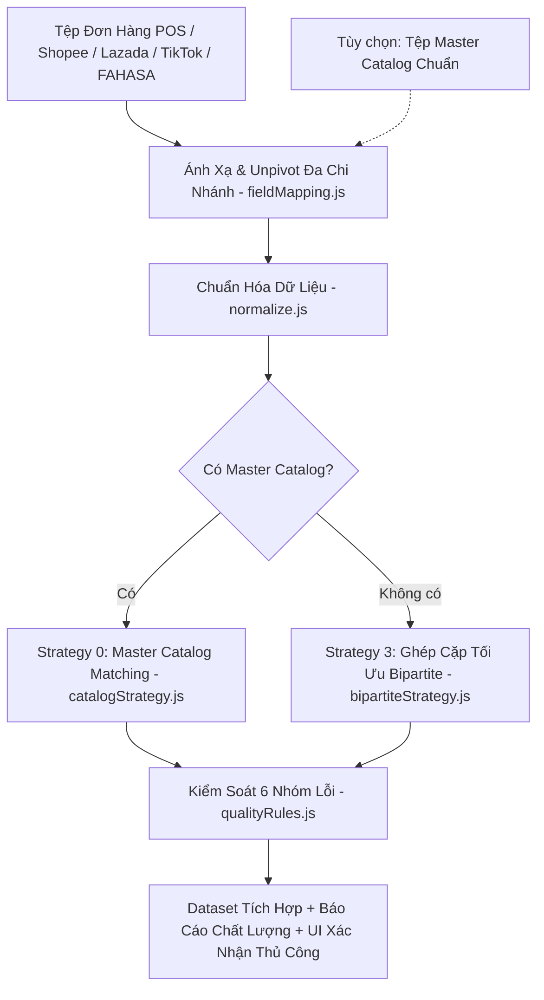

# 🛒 Hệ Thống Tích Hợp & Kiểm Soát Chất Lượng Dữ Liệu Bán Hàng Đa Nguồn

Dự án Khóa luận tốt nghiệp ngành Hệ thống thông tin — Trường Đại học Công nghệ Thông tin (UIT — ĐHQG TP.HCM).  
**Sinh viên thực hiện:** Phạm Anh Quốc & Trần Thanh Huy.  
**🌐 Live Demo (Vercel):** [https://data-integration-app-phamanhquoc-httts-projects.vercel.app/](https://data-integration-app-phamanhquoc-httts-projects.vercel.app/)

---

## 🏛️ Kiến trúc & Luồng xử lý (Data Pipeline)

Hệ thống hoạt động theo kiến trúc Client-side pure JavaScript trên nền Vite + React. Hỗ trợ **Chế độ Kép (Dual Mode)** linh hoạt: Có sẵn Danh mục sản phẩm chuẩn **HOẶC** Tự động đối chiếu chéo giữa các nguồn đơn hàng (POS, Shopee, Lazada, TikTok Shop, FAHASA) bằng thuật toán **Ghép cặp tối ưu toàn cục (Bipartite Optimal Matching)** theo kiến trúc **Strategy Pattern**.



---

## 📁 Cấu trúc thư mục dự án

```text
data-integration-app/
├── public/                 # Assets tĩnh
├── sample-data/            # Bộ dữ liệu mẫu Excel thực tế (Đa ngành hàng)
│   ├── bao-cao-phan-phoi-fahasa.xlsx # Báo cáo đa chi nhánh chuẩn template FAHASA
│   ├── don-hang-online-shopee.xlsx   # Đơn hàng sàn TMĐT Shopee (Sách, Thời trang, Gia dụng, Mỹ phẩm)
│   ├── don-hang-pos-cua-hang.xlsx    # Đơn hàng tại quầy POS
│   └── danh-muc-san-pham-chuan.xlsx  # Master Catalog sản phẩm chuẩn đa ngành
├── scripts/
│   └── generate-sample-data.cjs  # Script sinh dữ liệu giả lập & dữ liệu thực tế
├── src/
│   ├── assets/
│   ├── logic/              # Modules xử lý lõi (Core Data Pipeline)
│   │   ├── __tests__/
│   │   │   └── logic.test.js    # Suite 51 unit tests tự động (Vitest)
│   │   ├── domainConfig.js      # Cơ sở tri thức Đa Ngành Hàng bán lẻ
│   │   ├── strategies/          # Kiến trúc Strategy Pattern giải quyết xung đột thực thể
│   │   │   ├── catalogStrategy.js      # Chiến lược khi có Master Catalog
│   │   │   ├── bipartiteStrategy.js    # Cơ chế 3: Ghép cặp tối ưu toàn cục
│   │   │   ├── clusteringStrategy.js   # Cơ chế 2: Tự động gom cụm
│   │   │   ├── masterSourceStrategy.js # Cơ chế 1: Chọn 1 nguồn làm chuẩn
│   │   │   └── index.js                # Strategy Registry & Dispatcher
│   │   ├── bipartiteMatching.js # Thuật toán ghép cặp tối ưu toàn cục & Tổng hợp danh mục
│   │   ├── entityResolution.js  # Đối chiếu thực thể 3 tầng
│   │   ├── fieldMapping.js      # Ánh xạ tên cột & Tự động Unpivot bảng ngang đa chi nhánh
│   │   ├── normalize.js         # Chuẩn hóa văn bản, mã đơn, kênh bán, trạng thái, thương hiệu, ISBN-13
│   │   ├── pipeline.js          # Pipeline chính kết nối xử lý
│   │   └── qualityRules.js      # Kiểm soát chất lượng dữ liệu (6 nhóm lỗi & 3 mức an toàn)
│   ├── App.jsx             # Giao diện React UI & 3 gói cấu hình nghiệp vụ
│   ├── index.css
│   └── main.jsx
├── index.html
├── package.json
├── README.md
└── vite.config.js
```

---

## 🛠️ Hướng dẫn cài đặt & Chạy ứng dụng

```bash
# 1. Cài đặt các gói phụ thuộc
npm install

# 2. Sinh tệp dữ liệu mẫu thực tế đa ngành hàng (Sách, Thời trang, Gia dụng, Mỹ phẩm)
node scripts/generate-sample-data.cjs

# 3. Chạy giao diện thử nghiệm (Dev server)
npm run dev

# 4. Chạy suite unit tests (Vitest - 51/51 tests pass)
npx vitest run

# 5. Đóng gói bản sản xuất (Production Build)
npm run build
```

---

## 📌 Các điểm cải tiến & Tính năng nổi bật
- **Chế độ Kép (Dual Mode)**: Tích hợp thành công cả khi có Master Catalog lẫn khi **không có file chuẩn** (tự động ghép cặp tối ưu bằng Bipartite Matching và tổng hợp danh mục đại diện, loại trừ 100% tranh chấp khớp).
- **Hỗ trợ Đa Ngành Hàng (Multi-Domain Retail)**: Chuẩn hóa và tích hợp mượt mà cho mọi mặt hàng: Sách & Xuất bản phẩm, Thời trang (Coolmate, Canifa, Nike), Điện tử & Gia dụng (Philips, Sunhouse, Xiaomi), Mỹ phẩm (Cocoon, La Roche-Posay).
- **Xử lý dữ liệu thực tế FAHASA**: Tự động nhận diện và chuyển đổi bảng ngang phân phối đa chi nhánh (Unpivot: `GDNSBT - Long Bình Tân`, `GDNSTD - Thủ Đức`...) thành từng dòng giao dịch bán lẻ.
- **Phân loại 3 mức xử lý an toàn**: `AUTO_FIXED` (tự động sửa), `NEEDS_CONFIRMATION` (cần xác nhận), `FLAGGED_ONLY` (chỉ gắn cờ).
- **Bao phủ đầy đủ 6 nhóm lỗi tích hợp**: Cấu trúc (Schema), Định danh (Entity), Giá trị (Value), Thời gian (Temporal), Ngữ nghĩa (Semantic), Kỹ thuật (Technical).
- **3 Gói Cấu hình Nghiệp vụ Thân thiện**: Tiêu chuẩn (Khuyên dùng), Nghiêm ngặt (Kế toán), Tự động tối đa (Bán lẻ đa sàn) kèm chú thích hover chi tiết.
- **Kiểm thử tự động**: Đạt **51/51 unit test cases** pass 100%.
