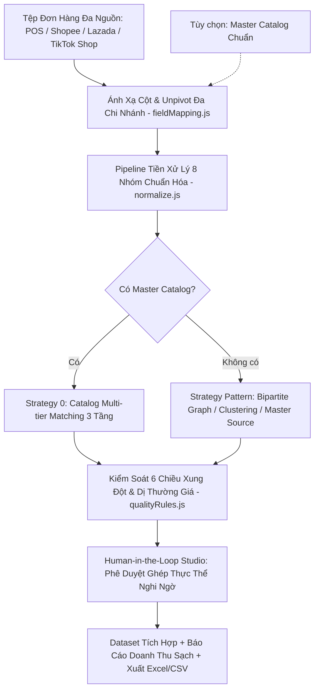

# 🛒 Hệ Thống Tích Hợp & Quản Trị Chất Lượng Dữ Liệu Bán Hàng Đa Kênh
### Multi-source Sales Data Integration and Data Quality Management System

> **Dự án Khóa luận Tốt nghiệp ngành Hệ thống Thông tin (HTTT)**  
> **Trường Đại học Công nghệ Thông tin — Đại học Quốc gia TP.HCM (UIT — ĐHQG-HCM)**  
> **Sinh viên thực hiện:** Phạm Anh Quốc & Trần Thanh Huy  
> **🌐 Live Demo (Vercel):** [https://data-integration-app-phamanhquoc-httts-projects.vercel.app/](https://data-integration-app-phamanhquoc-httts-projects.vercel.app/)

---

## 🎯 Giới thiệu Đề tài & Mục tiêu Khoa học

Hệ thống được thiết kế và hiện thực nhằm giải quyết bài toán phân mảnh, sai lệch cấu trúc và bất đồng nhất ngữ nghĩa khi tổng hợp dữ liệu giao dịch bán lẻ từ nhiều kênh phân phối (POS tại quầy, Shopee, TikTok Shop, Lazada, FAHASA,...).

Hệ thống bám sát **3 Câu hỏi Nghiên cứu (Research Questions - RQ)** trọng tâm của Khóa luận:

1. **RQ1 (Chuẩn hóa Đa nguồn & Tiền xử lý):** Khắc phục tính không đồng nhất về cấu trúc, định dạng và mã hóa thông qua **7-8 nhóm chuẩn hóa cốt lõi** kết hợp thuật toán **Tự động nhận diện Schema & Unpivot đa chi nhánh**.
2. **RQ2 (Đối chiếu Thực thể - Entity Resolution):** Đánh giá thực nghiệm hiệu quả của phương pháp **Multi-tier Matching (3 tầng: Mã SKU chính xác $\rightarrow$ Bảng mã Crosswalk $\rightarrow$ Fuzzy Token-Sort)** so với Exact Matching đơn thuần; hỗ trợ chế độ tích hợp đa nguồn không có Catalog chuẩn qua **Strategy Pattern** (*Ghép cặp tối ưu toàn cục Bipartite Graph*, *Gom cụm Clustering*, *Master Source*).
3. **RQ3 (Kiểm soát Chất lượng & Đảm bảo Doanh thu Thực):** Xây dựng bộ quy tắc phát hiện **6 chiều xung đột dữ liệu** phân loại theo **3 mức độ an toàn** (`AUTO_FIXED`, `NEEDS_CONFIRMATION`, `FLAGGED_ONLY`), loại trừ 100% doanh thu ảo từ đơn hủy/hoàn và cung cấp cơ chế kiểm toán quản trị (Governance Audit Trail).
4. **HITL (Human-in-the-Loop Active Learning):** Phân hệ đối soát thực thể có giám sát của chuyên gia đối với các bản ghi nằm trong vùng tương đồng nghi ngờ ($70\% - 90\%$).

---

## 🏛️ Kiến trúc Hệ thống & Luồng Pipeline

Hệ thống vận hành theo kiến trúc Client-side hiệu năng cao trên nền tảng **React 19 + Vite**, đảm bảo bảo mật dữ liệu doanh nghiệp (toàn bộ quá trình tính toán và kiểm toán diễn ra cục bộ trong trình duyệt, không gửi dữ liệu giao dịch lên máy chủ thứ ba).


```mermaid
graph TD
    A[Tệp Đơn Hàng Đa Nguồn: POS / Shopee / Lazada / TikTok Shop] --> B[Ánh Xạ Cột & Unpivot Đa Chi Nhánh - fieldMapping.js]
    C[Tùy chọn: Master Catalog Chuẩn] -.-> B
    B --> D[Pipeline Tiền Xử Lý 8 Nhóm Chuẩn Hóa - normalize.js]
    D --> E{Có Master Catalog?}
    E -- Có --> F[Strategy 0: Catalog Multi-tier Matching 3 Tầng]
    E -- Không có --> G[Strategy Pattern: Bipartite Graph / Clustering / Master Source]
    F --> H[Kiểm Soát 6 Chiều Xung Đột & Dị Thường Giá - qualityRules.js]
    G --> H
    H --> I[Human-in-the-Loop Studio: Phê Duyệt Ghép Thực Thể Nghi Ngờ]
    I --> J[Dataset Tích Hợp + Báo Cáo Doanh Thu Sạch + Xuất Excel/CSV]
```

---

## 📁 Cấu trúc Thư mục Dự án

Mã nguồn được tổ chức theo quy chuẩn **Clean Architecture / Modular Components**:

```text
data-integration-app/
├── public/                     # Static assets & Icons
├── sample-data/                # Bộ dữ liệu mẫu Excel kiểm thử thực tế
│   ├── Danh_Muc_Sach_Master.xlsx     # Master Catalog sản phẩm chuẩn
│   ├── Don_Hang_Shopee.xlsx          # Đơn hàng sàn TMĐT Shopee
│   ├── Don_Hang_TikTok_Shop.xlsx     # Đơn hàng TikTok Shop
│   ├── Don_Hang_POS.xlsx             # Đơn hàng bán lẻ tại quầy
│   └── Don_Hang_Lazada.xlsx          # Đơn hàng Lazada
├── scripts/                    # Scripts kiểm tra và sinh dữ liệu mẫu
├── src/
│   ├── components/             # Kiến trúc giao diện phân tầng (Enterprise UI)
│   │   ├── common/
│   │   │   ├── Badge.jsx             # Severity badges, Academic badges [RQ1, RQ2, RQ3, HITL]
│   │   │   └── ErrorBoundary.jsx     # Bọc lỗi giao diện an toàn
│   │   ├── layout/
│   │   │   ├── Header.jsx            # Topbar chuẩn Enterprise UIT, branding, actions
│   │   │   └── PipelineProgress.jsx  # Mô phỏng luồng DAG 4 giai đoạn xử lý dữ liệu
│   │   ├── upload/
│   │   │   ├── OrdersDropzone.jsx    # Kéo thả đa tệp đơn hàng, gắn nhãn kênh
│   │   │   ├── CatalogDropzone.jsx   # Kéo thả Master Catalog chuẩn
│   │   │   └── PresetSelector.jsx    # 3 gói cấu hình nghiệp vụ trực quan
│   │   ├── dashboard/
│   │   │   └── MetricStatCards.jsx   # 4 thẻ KPI cân đối (Đơn hàng, Match Rate, Lỗi, Doanh thu sạch)
│   │   ├── tabs/
│   │   │   ├── OverviewTab.jsx         # Biểu đồ phân bổ doanh thu kênh & Top sản phẩm sạch
│   │   │   ├── IssuesTab.jsx           # Bảng kiểm soát 6 chiều xung đột & bộ lọc tức thì
│   │   │   ├── HitlWorkbenchTab.jsx    # Studio đối soát thực thể Human-in-the-Loop dạng Diff View
│   │   │   ├── ScientificReportTab.jsx # Báo cáo thực nghiệm khoa học tổng hợp RQ1, RQ2, RQ3
│   │   │   └── MasterDataGridTab.jsx   # Bảng Master Data tìm kiếm đa trường & copy 1-click
│   │   └── modals/
│   │       └── AdvancedConfigModal.jsx # Modal tinh chỉnh siêu tham số và Strategy Engine
│   ├── logic/                  # Phân hệ thuật toán xử lý cốt lõi (Core Engine)
│   │   ├── __tests__/
│   │   │   └── logic.test.js         # Bộ 62 Unit Tests tự động (Vitest - 100% Pass)
│   │   ├── strategies/         # Strategy Pattern phân giải thực thể
│   │   │   ├── catalogStrategy.js      # Đối chiếu 3 tầng khi có Master Catalog
│   │   │   ├── bipartiteStrategy.js    # Ghép cặp tối ưu toàn cục Bipartite (Progressive đa nguồn)
│   │   │   ├── clusteringStrategy.js   # Gom cụm tự động liên kết đa nguồn
│   │   │   ├── masterSourceStrategy.js # Chỉ định 1 tệp nguồn làm chuẩn
│   │   │   └── index.js                # Strategy Registry & Dispatcher
│   │   ├── bipartiteMatching.js# Thuật toán Bipartite Graph Matching & Tổng hợp Catalog
│   │   ├── entityResolution.js # Multi-tier Entity Resolution Engine (Exact -> Crosswalk -> Fuzzy)
│   │   ├── fieldMapping.js     # Specificity Scoring Schema Matching & Unpivot đa chi nhánh
│   │   ├── normalize.js        # 8 nhóm chuẩn hóa (Văn bản, Mã SKU, Ngày/giờ, Kênh, Trạng thái, ISBN-13)
│   │   ├── pipeline.js         # Điều phối toàn bộ Data Pipeline & Kiểm toán quản trị
│   │   └── qualityRules.js     # 6 nhóm quy tắc xung đột chất lượng & 3 cấp độ an toàn
│   ├── App.jsx                 # Bộ điều phối trạng thái ứng dụng chính
│   ├── index.css               # Typography Inter, JetBrains Mono & Design Tokens
│   └── main.jsx
├── index.html                  # Metadata chuẩn SEO & Web Fonts
├── package.json
├── tailwind.config.js
└── vite.config.js
```

---

## 🚀 Hướng Dẫn Cài Đặt & Chạy Cục Bộ (Local)

### 1. Yêu cầu môi trường
* **Node.js**: $\ge 18.x$
* **npm**: $\ge 9.x$

### 2. Cài đặt và khởi chạy
```bash
# Bước 1: Clone kho mã nguồn
git clone https://github.com/PhamAnhQuoc-HTTT/data-integration-app.git
cd data-integration-app

# Bước 2: Cài đặt các gói thư viện phụ thuộc
npm install

# Bước 3: Khởi động máy chủ phát triển (Dev Server)
npm run dev
# Truy cập giao diện ứng dụng tại: http://localhost:5173/
```

### 3. Kiểm thử tự động (Unit Tests)
Dự án được bảo vệ bằng bộ test case nghiêm ngặt kiểm tra toàn bộ logic chuẩn hóa, ma trận đối chiếu Bipartite và kiểm toán quản trị:
```bash
# Chạy toàn bộ 62 test cases bằng Vitest
npx vitest run
```
*Kết quả:* **62/62 tests passed (100%)**.

### 4. Đóng gói triển khai sản phẩm (Production Build)
```bash
npm run build
npm run preview
```

---

## 🌟 Các Tính Năng Nổi Bật

### 1. Thiết kế Giao diện Enterprise Chuẩn Mực
* **Thẩm mỹ Hiện đại (High-Tech Enterprise Aesthetic):** Bảng màu trung tính Slate/Indigo/Emerald, loại bỏ hoàn toàn emoji hoạt họa, sử dụng 100% bộ vector icons chuẩn công nghiệp từ `lucide-react`.
* **Typography Khoa học:** Google Fonts `Inter` cho giao diện người dùng và `JetBrains Mono` cho Mã SKU, Mã Đơn, Điểm % tương đồng và số liệu kiểm toán.
* **4 Thẻ KPI Cân Đối:** Hiển thị tức thì tổng số bản ghi, tỷ lệ định danh kèm nhãn RQ2, số xung đột chất lượng và doanh thu sạch sau loại trừ đơn hủy.

### 2. Khả Năng Xuất Dữ Liệu Kép (Dual Export)
* **Xuất Excel (`.xlsx`):** Tạo file bảng tính Microsoft Excel gốc thông qua SheetJS, tự động tính toán và căn chỉnh độ rộng cột (`!cols`) vừa vặn cho từng trường dữ liệu.
* **Xuất CSV (`.csv`):** Hỗ trợ tiền tố **UTF-8 BOM (`\uFEFF`)** chống lỗi hiển thị dấu tiếng Việt trên mọi phiên bản Excel và phần mềm BI.

### 3. Bộ 3 Gói Cấu Hình Nghiệp Vụ Linh Hoạt
* **Tiêu Chuẩn (Khuyên dùng):** Ngưỡng duyệt tay $70\% - 90\%$, cảnh báo lệch giá $> 30\%$. Phù hợp cho bán lẻ đa kênh thông thường.
* **Nghiêm Ngặt (Kiểm toán / Tài chính):** Ngưỡng tự động $\ge 95\%$, cảnh báo lệch giá $> 15\%$. Ưu tiên tối đa độ chính xác cho quyết toán kế toán.
* **Tự Động Hóa Cao (TMĐT):** Ngưỡng tự động $\ge 80\%$, cho phép lệch giá tới $50\%$. Tối ưu tốc độ xử lý cho khối lượng đơn hàng online lớn.
